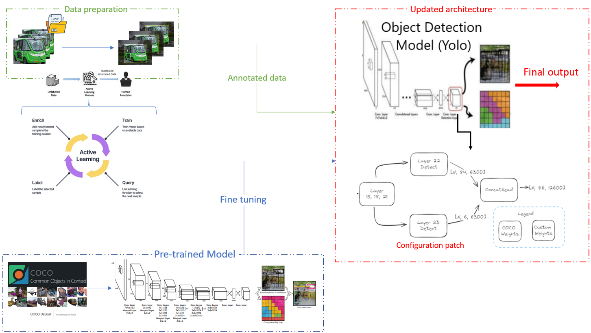
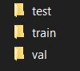
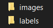
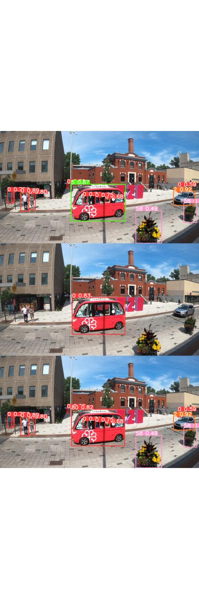

# Detection of autonomous-shuttle vehicles in urban traffic videos
This project introduces an object detection model, YOLO2xHead, specifically designed to add additional detatcion heads to any YOLO detection model (the detection of autonomous shuttles vehicles in urban traffic videos in our case). By merging the output of the pre trained model and the custom model into one.
## Key Contributions
- Construction of a comprehensive dataset focused on urban autonomous shuttles.
- coming up with a solution using transfer learning to update any existent YOLO model without the need to re train on the whole data set.
Below is the overview of our YOLO2xHead model and solution, illustrating the integration of 2 detection head (can be implemented for multiple heads)

## Dataset

The dataset is crafted for detecting autonomous shuttles Vehicles in urban environments, comprising:

- Images capturing diverse urban traffic scenarios.
- Annotations in YOLO formats.
- Pre-trained model checkpoints, allowing users to benchmark or further fine-tune.
This is not the full data set used in the training!
https://universe.roboflow.com/v1-eaxup/autonomous_shuttles-4/model/1

## Getting Started
In this Repo you can find three folders
- Yolov8 is used to train a pretrained yolov8 model on our custom data set (just upload your data set in the following format:

and then edit the config file accordingly
- Yolov10 is used to train a pretrained yolov10 model on our custom data set (just upload your data set in the same format as before)
- expand is where the you can find the patch for modifying the yolov8 model (chnages must be done if you are using another model in the patch and the implemenatation file and the callbacks.)
  just follow the steps in expand.py and keep an eye out to make the neccessary changes to adapt it to your specific case (changes like data set config file / model version / hyperparamaters / layers to 
  freeze / weights to transfer and their respective paths ...)

  ## Results

  ## Contact
For any questions or issues faced during the execution of code, feel free to reach out to me in: aziz11younes@gmail.com . 
